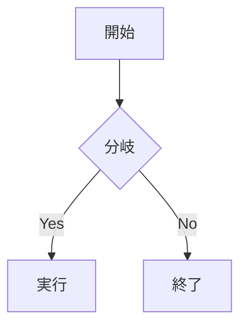

# Zenn記法対応 Implementation Plan

> **For agentic workers:** REQUIRED SUB-SKILL: Use superpowers:subagent-driven-development (recommended) or superpowers:executing-plans to implement this plan task-by-task. Steps use checkbox (`- [ ]`) syntax for tracking.

**Goal:** noguchy.me のブログ記事を Zenn と同じ Markdown 記法（`:::message` / 数式 / mermaid / 画像幅・キャプション / `lang:ファイル名`・`diff` / リンクカード・埋め込み）で書けるようにする。AstroPaper の既存パイプライン・テーマ・ダークモードは維持する。

**Architecture:** Astro の `markdown.remarkPlugins` / `rehypePlugins` / `shikiConfig.transformers` に、機能別の自作プラグイン（+ remark-math / rehype-katex）を追加する。本文の描画（`render(post)` → `<Content />`）自体は差し替えない。Zenn 公式パッケージは使わない。標準パースで壊れる構文（`:::` コンテナ・画像幅 `=250x`）は「ソース文字列を変換して `this.parse` で再パースする」remark プラグインで処理し、それ以外は mdast/hast レベルで処理する。

**Tech Stack:** Astro 5 / unified(remark/rehype) / Shiki / remark-math / rehype-katex / katex / mermaid / Vitest（プラグイン単体テスト）/ pnpm / TailwindCSS v4

---

## 事前に確定済みの事実（実測ベース）

- ` ```js:foo.js ` → mdast `code` node の `lang="js:foo.js"`, `meta=null`
- ` ```diff js ` → `lang="diff"`, `meta="js"`, `value` は `+`/`-` 付き行
- `` は **画像として一切パースされない**（スペースで URL が分断され text+link になる）→ ソース前処理が必須
- `` + 次行 `*caption*` → 同一 paragraph 内に `image` / `text("\n")` / `emphasis` として出る → mdast で処理可
- 裸 URL 単独行 → `paragraph > link`（`link.url === テキスト`）→ mdast で処理可
- `@[youtube](id)` → `text "@"` + `link(text="youtube", url="id")` → mdast で処理可
- `remark-directive` は `:::message alert` / `:::details タイトル` / `::::` ネストを Zenn 通りには解釈できない → コンテナは自作パーサ（ソース前処理）で対応
- テーマトークン（`src/styles/global.css`）: `--background --foreground --foreground-dark --accent --accent-hover --muted --border --light`。ダークは `html[data-theme="dark"]` で各変数が切り替わる（= トークンを使えばダーク自動対応）
- 既存 Shiki 設定（`astro.config.mjs`）: `transformerFileName`（`file="..."` メタを読む）/ highlight / notationDiff が稼働中。これらは温存し、追加分を append する

---

## ファイル構成

新規:
- `src/plugins/remark-zenn-code.mjs` — `lang:ファイル名`・`diff lang` を Shiki 用メタに変換
- `src/utils/transformers/zennDiff.js` — `diff` の add/remove 行に CSS クラスを付ける Shiki transformer
- `src/plugins/remark-zenn-mermaid.mjs` — `mermaid` コードブロック → `<pre class="mermaid">`
- `src/plugins/remark-zenn-source.mjs` — `:::message`/`:::details`・画像幅 `=250x`（ソース再パース方式）
- `src/plugins/remark-zenn-figure.mjs` — 画像 + `*caption*` → `<figure>`/`<figcaption>`
- `src/plugins/remark-zenn-embed.mjs` — 裸 URL カード（OGP）・`@[provider](arg)` 埋め込み
- `src/plugins/*.test.mjs` — 各プラグインの Vitest 単体テスト
- `src/plugins/test-helper.mjs` — テスト用 unified プロセッサ

変更:
- `astro.config.mjs` — プラグイン/transformer の登録、remark-math/rehype-katex
- `src/layouts/PostDetails.astro` — mermaid 描画クライアントスクリプト追加
- `src/styles/global.css` — `:::message`/`:::details`/`figure`/mermaid/diff のスタイル
- `package.json` — devDeps（vitest 等）と deps（remark-math/rehype-katex/katex/mermaid）

---

## Task 1: Vitest テスト基盤とテストヘルパー

**Files:**
- Modify: `package.json`
- Create: `src/plugins/test-helper.mjs`
- Create: `src/plugins/smoke.test.mjs`（基盤動作確認用、後で削除可）

- [ ] **Step 1: テスト用 devDependencies を追加**

Run:
```bash
pnpm add -D vitest unified remark-parse remark-gfm remark-rehype rehype-stringify
```
Expected: 追加が成功し `package.json` の devDependencies に各パッケージが入る。

- [ ] **Step 2: `package.json` に test スクリプトを追加**

`package.json` の `scripts` に以下を追加（既存行は残す）:
```json
    "test": "vitest run"
```

- [ ] **Step 3: テストヘルパーを作成**

Create `src/plugins/test-helper.mjs`:
```js
import { unified } from "unified";
import remarkParse from "remark-parse";
import remarkGfm from "remark-gfm";
import remarkRehype from "remark-rehype";
import rehypeStringify from "rehype-stringify";

/**
 * remark プラグインを与えて Markdown → HTML 文字列に変換するテスト用ヘルパー。
 * plugins は [plugin, options?] のタプル配列。
 */
export async function render(md, plugins = []) {
  const processor = unified().use(remarkParse).use(remarkGfm);
  for (const entry of plugins) {
    const [plugin, options] = Array.isArray(entry) ? entry : [entry];
    processor.use(plugin, options);
  }
  processor
    .use(remarkRehype, { allowDangerousHtml: true })
    .use(rehypeStringify, { allowDangerousHtml: true });
  const file = await processor.process(md);
  return String(file);
}
```

- [ ] **Step 4: 基盤の動作確認テストを書く**

Create `src/plugins/smoke.test.mjs`:
```js
import { describe, it, expect } from "vitest";
import { render } from "./test-helper.mjs";

describe("test-helper", () => {
  it("renders plain markdown", async () => {
    const html = await render("# Hello");
    expect(html).toContain("<h1>Hello</h1>");
  });
});
```

- [ ] **Step 5: テストを実行して通ることを確認**

Run: `pnpm run test`
Expected: PASS（1 test passed）

- [ ] **Step 6: フォーマット・コミット**

```bash
pnpm run format
git add package.json pnpm-lock.yaml src/plugins/test-helper.mjs src/plugins/smoke.test.mjs
git commit -m "test: Vitestによるremarkプラグイン単体テスト基盤を追加"
```

---

## Task 2: コードブロックのファイル名・diff 対応（remark-zenn-code + Shiki transformer）

**Files:**
- Create: `src/plugins/remark-zenn-code.mjs`
- Create: `src/plugins/remark-zenn-code.test.mjs`
- Create: `src/utils/transformers/zennDiff.js`
- Modify: `astro.config.mjs`
- Modify: `src/styles/global.css`

- [ ] **Step 1: 失敗するテストを書く**

Create `src/plugins/remark-zenn-code.test.mjs`:
```js
import { describe, it, expect } from "vitest";
import { unified } from "unified";
import remarkParse from "remark-parse";
import remarkGfm from "remark-gfm";
import remarkZennCode from "./remark-zenn-code.mjs";

function parse(md) {
  const tree = unified().use(remarkParse).use(remarkGfm).use(remarkZennCode).parse(md);
  return unified().use(remarkParse).use(remarkGfm).use(remarkZennCode).runSync(tree);
}
function firstCode(tree) {
  return tree.children.find(n => n.type === "code");
}

describe("remark-zenn-code", () => {
  it("converts lang:file into lang + file= meta", () => {
    const code = firstCode(parse("```js:foo.js\nconst a = 1;\n```\n"));
    expect(code.lang).toBe("js");
    expect(code.meta).toContain('file="foo.js"');
  });

  it("converts `diff js` into js lang with diff line metadata", () => {
    const code = firstCode(parse("```diff js\n+added\n-removed\n const x = 1;\n```\n"));
    expect(code.lang).toBe("js");
    expect(code.meta).toContain("zenn-diff");
    expect(code.meta).toContain('zenn-diff-add="1"');
    expect(code.meta).toContain('zenn-diff-del="2"');
  });

  it("converts `diff js:foo.js` into js lang + file + diff", () => {
    const code = firstCode(parse("```diff js:foo.js\n+added\n```\n"));
    expect(code.lang).toBe("js");
    expect(code.meta).toContain('file="foo.js"');
    expect(code.meta).toContain("zenn-diff");
  });

  it("leaves plain code blocks untouched", () => {
    const code = firstCode(parse("```js\nconst a = 1;\n```\n"));
    expect(code.lang).toBe("js");
    expect(code.meta).toBeFalsy();
  });
});
```

- [ ] **Step 2: テストを実行して失敗を確認**

Run: `pnpm run test src/plugins/remark-zenn-code.test.mjs`
Expected: FAIL（`Cannot find module './remark-zenn-code.mjs'`）

- [ ] **Step 3: プラグインを実装**

Create `src/plugins/remark-zenn-code.mjs`:
```js
import { visit } from "unist-util-visit";

/**
 * Zenn のコードブロック記法を Shiki が解釈できるメタに変換する。
 * - ```lang:ファイル名      → lang + `file="ファイル名"`（既存 fileName transformer 用）
 * - ```diff lang[:file]     → lang を実言語にし、+/- 行番号を zenn-diff メタに格納
 */
export default function remarkZennCode() {
  return tree => {
    visit(tree, "code", node => {
      if (!node.lang) return;

      // ```diff lang[:file]
      if (node.lang === "diff") {
        const tokens = (node.meta || "").trim().split(/\s+/).filter(Boolean);
        const langToken = tokens.shift(); // "js" or "js:foo.js" or undefined
        if (!langToken) return; // 素の diff は Shiki の diff 言語に任せる
        const [realLang, ...fileParts] = langToken.split(":");
        node.lang = realLang;
        const file = fileParts.join(":");
        const { add, del } = collectDiffLines(node.value);
        const pieces = [...tokens];
        if (file) pieces.push(`file="${file}"`);
        pieces.push("zenn-diff");
        if (add.length) pieces.push(`zenn-diff-add="${add.join(",")}"`);
        if (del.length) pieces.push(`zenn-diff-del="${del.join(",")}"`);
        node.meta = pieces.join(" ");
        return;
      }

      // ```lang:ファイル名
      if (node.lang.includes(":")) {
        const [realLang, ...fileParts] = node.lang.split(":");
        node.lang = realLang;
        const file = fileParts.join(":");
        node.meta = [node.meta, `file="${file}"`].filter(Boolean).join(" ");
      }
    });
  };
}

/** value の各行先頭の +/- を見て 1 始まりの行番号を集める（マーカー文字は残す） */
function collectDiffLines(code) {
  const add = [];
  const del = [];
  code.split("\n").forEach((line, i) => {
    if (line.startsWith("+")) add.push(i + 1);
    else if (line.startsWith("-")) del.push(i + 1);
  });
  return { add, del };
}
```

- [ ] **Step 4: テストを実行して通ることを確認**

Run: `pnpm run test src/plugins/remark-zenn-code.test.mjs`
Expected: PASS（4 tests passed）

- [ ] **Step 5: Shiki transformer を実装**

Create `src/utils/transformers/zennDiff.js`:
```js
/**
 * remark-zenn-code が付与した zenn-diff メタを読み、
 * 指定行に `diff add` / `diff remove` クラスを付ける Shiki transformer。
 * 既存の notation diff と同じクラス名を使うため CSS を共有できる。
 */
export const transformerZennDiff = () => ({
  name: "zenn-diff",
  line(node, line) {
    const raw = this.options.meta?.__raw || "";
    if (!raw.includes("zenn-diff")) return;
    const add = parseLineList(raw, "zenn-diff-add");
    const del = parseLineList(raw, "zenn-diff-del");
    if (add.includes(line)) this.addClassToHast(node, "diff add");
    else if (del.includes(line)) this.addClassToHast(node, "diff remove");
  },
});

function parseLineList(raw, key) {
  const match = raw.match(new RegExp(`${key}="([^"]*)"`));
  if (!match) return [];
  return match[1].split(",").map(Number);
}
```

- [ ] **Step 6: astro.config に登録**

`astro.config.mjs` の import 群に追記:
```js
import remarkZennCode from "./src/plugins/remark-zenn-code.mjs";
import { transformerZennDiff } from "./src/utils/transformers/zennDiff";
```
`markdown.remarkPlugins` を以下に変更（先頭に追加）:
```js
    remarkPlugins: [
      remarkZennCode,
      remarkToc,
      [remarkCollapse, { test: "Table of contents" }],
    ],
```
`shikiConfig.transformers` の末尾に追加:
```js
        transformerNotationDiff({ matchAlgorithm: "v3" }),
        transformerZennDiff(),
```

- [ ] **Step 7: diff の行スタイル CSS を追加（無ければ）**

Run: `grep -n "diff" src/styles/global.css src/styles/typography.css`
`.line.diff.add` / `.line.diff.remove` のスタイルが無い場合、`src/styles/global.css` の末尾に追加:
```css
/* Zenn 風 diff 行 */
.astro-code .line.diff.add {
  background-color: rgb(34 197 94 / 0.16);
  display: inline-block;
  width: 100%;
}
.astro-code .line.diff.remove {
  background-color: rgb(244 63 94 / 0.16);
  display: inline-block;
  width: 100%;
}
```

- [ ] **Step 8: ビルドで型チェック・実描画を確認**

Run: `pnpm run build`
Expected: ビルド成功。確認用に一時的に記事へ ` ```diff js ` ブロックを足して `pnpm dev` で目視（add 行が緑、remove 行が赤、ファイル名表示も機能）。確認後その記述は戻す。

- [ ] **Step 9: フォーマット・コミット**

```bash
pnpm run format && pnpm run lint
git add src/plugins/remark-zenn-code.mjs src/plugins/remark-zenn-code.test.mjs src/utils/transformers/zennDiff.js astro.config.mjs src/styles/global.css
git commit -m "feat: コードブロックのZenn記法(lang:ファイル名 / diff lang)に対応"
```

---

## Task 3: mermaid 図対応（remark-zenn-mermaid + クライアント描画）

**Files:**
- Create: `src/plugins/remark-zenn-mermaid.mjs`
- Create: `src/plugins/remark-zenn-mermaid.test.mjs`
- Modify: `astro.config.mjs`
- Modify: `src/layouts/PostDetails.astro`
- Modify: `src/styles/global.css`
- Modify: `package.json`

- [ ] **Step 1: 失敗するテストを書く**

Create `src/plugins/remark-zenn-mermaid.test.mjs`:
```js
import { describe, it, expect } from "vitest";
import { render } from "./test-helper.mjs";
import remarkZennMermaid from "./remark-zenn-mermaid.mjs";

describe("remark-zenn-mermaid", () => {
  it("converts a mermaid code block into a pre.mermaid element", async () => {
    const md = "```mermaid\ngraph TD\n  A-->B\n```\n";
    const html = await render(md, [remarkZennMermaid]);
    expect(html).toContain('<pre class="mermaid"');
    expect(html).toContain("graph TD");
    expect(html).not.toContain("<code");
  });

  it("escapes html-sensitive chars in the diagram source", async () => {
    const md = "```mermaid\ngraph LR\n  a --> b & c\n```\n";
    const html = await render(md, [remarkZennMermaid]);
    expect(html).toContain("&amp;");
  });

  it("leaves non-mermaid code blocks untouched", async () => {
    const html = await render("```js\nconst a=1;\n```\n", [remarkZennMermaid]);
    expect(html).toContain("<code");
  });
});
```

- [ ] **Step 2: テストを実行して失敗を確認**

Run: `pnpm run test src/plugins/remark-zenn-mermaid.test.mjs`
Expected: FAIL（モジュール未作成）

- [ ] **Step 3: プラグインを実装**

Create `src/plugins/remark-zenn-mermaid.mjs`:
```js
import { visit } from "unist-util-visit";

/**
 * ```mermaid コードブロックを <pre class="mermaid"> の raw HTML ノードに変換する。
 * code ノードを html ノードに置換することで Shiki のハイライト対象から外し、
 * クライアント側の mermaid.run() がそのまま図に描画できるようにする。
 */
export default function remarkZennMermaid() {
  return tree => {
    visit(tree, "code", (node, index, parent) => {
      if (node.lang !== "mermaid" || !parent || index === null) return;
      parent.children[index] = {
        type: "html",
        value: `<pre class="mermaid">${escapeHtml(node.value)}</pre>`,
      };
    });
  };
}

function escapeHtml(str) {
  return str
    .replace(/&/g, "&amp;")
    .replace(/</g, "&lt;")
    .replace(/>/g, "&gt;");
}
```

- [ ] **Step 4: テストを実行して通ることを確認**

Run: `pnpm run test src/plugins/remark-zenn-mermaid.test.mjs`
Expected: PASS（3 tests passed）

- [ ] **Step 5: mermaid を依存追加**

Run: `pnpm add mermaid`
Expected: dependencies に `mermaid` が入る。

- [ ] **Step 6: astro.config に登録**

`astro.config.mjs` の import に追記:
```js
import remarkZennMermaid from "./src/plugins/remark-zenn-mermaid.mjs";
```
`remarkPlugins` に `remarkZennMermaid` を追加（`remarkZennCode` の次）:
```js
    remarkPlugins: [
      remarkZennCode,
      remarkZennMermaid,
      remarkToc,
      [remarkCollapse, { test: "Table of contents" }],
    ],
```

- [ ] **Step 7: PostDetails にクライアント描画スクリプトを追加**

`src/layouts/PostDetails.astro` の末尾（既存の `<script>` 群の近く）に追加:
```astro
<script>
  // mermaid 図がある記事だけ動的に描画する
  const blocks = document.querySelectorAll<HTMLElement>("pre.mermaid");
  if (blocks.length > 0) {
    const { default: mermaid } = await import("mermaid");
    const isDark =
      document.documentElement.getAttribute("data-theme") === "dark";
    mermaid.initialize({
      startOnLoad: false,
      theme: isDark ? "dark" : "default",
    });
    await mermaid.run({ nodes: blocks });
  }
</script>
```

- [ ] **Step 8: mermaid コンテナの CSS を追加**

`src/styles/global.css` 末尾に追加:
```css
pre.mermaid {
  display: flex;
  justify-content: center;
  background: transparent;
  padding: 1rem 0;
}
```

- [ ] **Step 9: ビルド & 目視確認**

Run: `pnpm run build`
Expected: 成功。`pnpm dev` で ` ```mermaid ` ブロックを含む記事を開き、図が描画される / ダークで dark テーマになることを確認。

- [ ] **Step 10: フォーマット・コミット**

```bash
pnpm run format && pnpm run lint
git add src/plugins/remark-zenn-mermaid.mjs src/plugins/remark-zenn-mermaid.test.mjs astro.config.mjs src/layouts/PostDetails.astro src/styles/global.css package.json pnpm-lock.yaml
git commit -m "feat: mermaid図のクライアント描画に対応"
```

---

## Task 4: メッセージ/アコーディオン・画像幅対応（remark-zenn-source）

**Files:**
- Create: `src/plugins/remark-zenn-source.mjs`
- Create: `src/plugins/remark-zenn-source.test.mjs`
- Modify: `astro.config.mjs`

実装方針: 標準パースで壊れる構文（`:::` コンテナと ``）は、`file.value`（生 Markdown 本文）を行単位で走査して raw HTML へ変換し、`this.parse` で再パースしてツリーを差し替える。`this.parse` は登録済みの micromark 拡張（gfm / math 等）を引き継ぐため、変換後の本文中の他記法も正しく解釈される。

- [ ] **Step 1: 失敗するテストを書く**

Create `src/plugins/remark-zenn-source.test.mjs`:
```js
import { describe, it, expect } from "vitest";
import { render } from "./test-helper.mjs";
import remarkZennSource from "./remark-zenn-source.mjs";

describe("remark-zenn-source", () => {
  it(":::message → info ボックス", async () => {
    const html = await render(":::message\nお知らせ\n:::\n", [remarkZennSource]);
    expect(html).toContain('class="zenn-msg zenn-msg-info"');
    expect(html).toContain("お知らせ");
  });

  it(":::message alert → alert ボックス", async () => {
    const html = await render(":::message alert\n警告\n:::\n", [remarkZennSource]);
    expect(html).toContain("zenn-msg-alert");
  });

  it(":::details タイトル → details/summary", async () => {
    const html = await render(":::details 詳しく\n中身\n:::\n", [remarkZennSource]);
    expect(html).toContain("<details");
    expect(html).toContain("<summary>詳しく</summary>");
    expect(html).toContain("中身");
  });

  it("ネスト(::::details > :::message)", async () => {
    const md = "::::details 親\n:::message\n子\n:::\n::::\n";
    const html = await render(md, [remarkZennSource]);
    expect(html).toContain("<details");
    expect(html).toContain("zenn-msg");
    expect(html).toContain("子");
  });

  it("コンテナ内の Markdown が解釈される", async () => {
    const html = await render(":::message\n**太字**\n:::\n", [remarkZennSource]);
    expect(html).toContain("<strong>太字</strong>");
  });

  it("画像幅 =250x → width 付き img", async () => {
    const html = await render("\n", [remarkZennSource]);
    expect(html).toContain(' {
    const html = await render("# 見出し\n\n本文\n", [remarkZennSource]);
    expect(html).toContain("<h1>見出し</h1>");
  });
});
```

- [ ] **Step 2: テストを実行して失敗を確認**

Run: `pnpm run test src/plugins/remark-zenn-source.test.mjs`
Expected: FAIL（モジュール未作成）

- [ ] **Step 3: プラグインを実装**

Create `src/plugins/remark-zenn-source.mjs`:
```js
/**
 * 標準パースで壊れる Zenn 構文をソース段階で raw HTML に変換し、再パースする。
 * - :::message / :::message alert / :::details タイトル（::::によるネスト対応）
 * -  /  の画像幅指定
 */
export default function remarkZennSource() {
  const self = this;
  return (tree, file) => {
    const original = String(file.value);
    const hasContainer = /^\s*:{3,}\S/m.test(original);
    const hasImageSize = /=\d+x\d*\)/.test(original);
    if (!hasContainer && !hasImageSize) return;

    // 先頭フロントマターは変換対象から除外（残っていれば）
    const fmMatch = original.match(/^---\r?\n[\s\S]*?\r?\n---\r?\n?/);
    const front = fmMatch ? fmMatch[0] : "";
    const body = original.slice(front.length);

    const transformed = transformSource(body);
    if (transformed === body) return;

    const newTree = self.parse(transformed);
    tree.children = newTree.children;
  };
}

function transformSource(src) {
  const lines = src.split("\n");
  const out = [];
  const stack = []; // { colons: number, close: string }

  for (let line of lines) {
    const fence = line.match(/^(:{3,})(.*)$/);
    if (fence) {
      const colons = fence[1].length;
      const rest = fence[2].trim();

      if (rest === "") {
        // 閉じフェンス（同じコロン数なら閉じる）
        if (stack.length && stack[stack.length - 1].colons === colons) {
          const top = stack.pop();
          out.push("", top.close, "");
          continue;
        }
      } else {
        // 開きフェンス
        const sp = rest.indexOf(" ");
        const name = sp === -1 ? rest : rest.slice(0, sp);
        const arg = sp === -1 ? "" : rest.slice(sp + 1).trim();
        const tags = openTags(name, arg);
        if (tags) {
          out.push("", tags.open, "");
          stack.push({ colons, close: tags.close });
          continue;
        }
      }
    }
    out.push(transformImageWidth(line));
  }

  // 閉じ忘れを補完
  while (stack.length) {
    out.push("", stack.pop().close, "");
  }
  return out.join("\n");
}

function openTags(name, arg) {
  if (name === "message") {
    const variant = arg === "alert" ? "zenn-msg-alert" : "zenn-msg-info";
    return {
      open: `<div class="zenn-msg ${variant}"><div class="zenn-msg-body">`,
      close: `</div></div>`,
    };
  }
  if (name === "details") {
    const title = escapeHtml(arg || "詳細");
    return {
      open: `<details class="zenn-details"><summary>${title}</summary><div class="zenn-details-body">`,
      close: `</div></details>`,
    };
  }
  return null;
}

function transformImageWidth(line) {
  return line.replace(
    /!\[([^\]]*)\]\(([^)\s]+)\s+=(\d+)x(\d*)\)/g,
    (_, alt, url, w, h) => {
      const height = h ? ` height="${h}"` : "";
      return ``;
    }
  );
}

function escapeHtml(str) {
  return str
    .replace(/&/g, "&amp;")
    .replace(/</g, "&lt;")
    .replace(/>/g, "&gt;")
    .replace(/"/g, "&quot;");
}
```

- [ ] **Step 4: テストを実行して通ることを確認**

Run: `pnpm run test src/plugins/remark-zenn-source.test.mjs`
Expected: PASS（7 tests passed）。失敗する場合は raw HTML の前後空行不足が原因のことが多いので `out.push("", tag, "")` の空行を確認する。

- [ ] **Step 5: astro.config に登録（最初の remark プラグインにする）**

`astro.config.mjs` の import に追記:
```js
import remarkZennSource from "./src/plugins/remark-zenn-source.mjs";
```
`remarkPlugins` の先頭へ `remarkZennSource` を追加:
```js
    remarkPlugins: [
      remarkZennSource,
      remarkZennCode,
      remarkZennMermaid,
      remarkToc,
      [remarkCollapse, { test: "Table of contents" }],
    ],
```

- [ ] **Step 6: ビルドで再パースが Astro 上でも動くことを確認**

Run: `pnpm run build`
Expected: 成功。`pnpm dev` で `:::message` / `:::details` / `` を含む記事を開き、HTML 構造が出ること（スタイルは次タスク）を確認。フロントマターが本文に漏れていないことも確認。

- [ ] **Step 7: フォーマット・コミット**

```bash
pnpm run format && pnpm run lint
git add src/plugins/remark-zenn-source.mjs src/plugins/remark-zenn-source.test.mjs astro.config.mjs
git commit -m "feat: :::message/:::details と画像幅指定(=250x)に対応"
```

---

## Task 5: メッセージ/アコーディオンのスタイル

**Files:**
- Modify: `src/styles/global.css`

- [ ] **Step 1: スタイルを追加**

`src/styles/global.css` 末尾に追加（テーマトークン使用でダーク自動対応）:
```css
/* Zenn 風メッセージ */
.zenn-msg {
  display: flex;
  gap: 0.6rem;
  margin: 1.5rem 0;
  padding: 0.9rem 1rem;
  border-radius: 0.5rem;
  background: var(--light);
  border: 1px solid var(--border);
  font-size: 0.95em;
}
.zenn-msg::before {
  content: "!";
  flex: none;
  width: 1.25rem;
  height: 1.25rem;
  border-radius: 9999px;
  background: var(--muted);
  color: var(--background);
  font-weight: 700;
  font-size: 0.85rem;
  display: grid;
  place-items: center;
}
.zenn-msg-alert {
  background: rgb(244 63 94 / 0.1);
  border-color: rgb(244 63 94 / 0.4);
}
.zenn-msg-alert::before {
  background: #f43f5e;
}
.zenn-msg-body > :first-child {
  margin-top: 0;
}
.zenn-msg-body > :last-child {
  margin-bottom: 0;
}

/* Zenn 風アコーディオン */
.zenn-details {
  margin: 1.5rem 0;
  border: 1px solid var(--border);
  border-radius: 0.5rem;
  overflow: hidden;
}
.zenn-details > summary {
  cursor: pointer;
  padding: 0.7rem 1rem;
  background: var(--light);
  font-weight: 600;
  list-style: revert;
}
.zenn-details-body {
  padding: 0.5rem 1rem 0.9rem;
}
.zenn-details-body > :first-child {
  margin-top: 0;
}
```

- [ ] **Step 2: 目視確認**

Run: `pnpm dev`
Expected: `:::message`（灰の!アイコン）/ `:::message alert`（赤系）/ `:::details`（開閉）がライト・ダーク両方で破綻しないこと。

- [ ] **Step 3: コミット**

```bash
pnpm run format
git add src/styles/global.css
git commit -m "style: :::message/:::detailsのスタイルを追加"
```

---

## Task 6: 画像キャプション対応（remark-zenn-figure）

**Files:**
- Create: `src/plugins/remark-zenn-figure.mjs`
- Create: `src/plugins/remark-zenn-figure.test.mjs`
- Modify: `astro.config.mjs`
- Modify: `src/styles/global.css`
- Modify: `package.json`

- [ ] **Step 1: 失敗するテストを書く**

Create `src/plugins/remark-zenn-figure.test.mjs`:
```js
import { describe, it, expect } from "vitest";
import { render } from "./test-helper.mjs";
import remarkZennFigure from "./remark-zenn-figure.mjs";

describe("remark-zenn-figure", () => {
  it("画像直後の *caption* を figcaption にする", async () => {
    const md = "\n*かわいい猫*\n";
    const html = await render(md, [remarkZennFigure]);
    expect(html).toContain("<figure");
    expect(html).toContain("<figcaption>かわいい猫</figcaption>");
    expect(html).toContain('src="https://ex.com/a.png"');
  });

  it("キャプションが無い画像はそのまま（figure化しない）", async () => {
    const md = "\n";
    const html = await render(md, [remarkZennFigure]);
    expect(html).not.toContain("<figure");
    expect(html).toContain(" {
    const md = "ただの文章 *強調*\n";
    const html = await render(md, [remarkZennFigure]);
    expect(html).not.toContain("<figure");
  });
});
```

- [ ] **Step 2: テストを実行して失敗を確認**

Run: `pnpm run test src/plugins/remark-zenn-figure.test.mjs`
Expected: FAIL（モジュール未作成）

- [ ] **Step 3: 依存追加（mdast-util-to-string）**

Run: `pnpm add -D mdast-util-to-string`
Expected: devDependencies に追加。（Astro が同梱しているが明示追加して import を安定させる）

- [ ] **Step 4: プラグインを実装**

Create `src/plugins/remark-zenn-figure.mjs`:
```js
import { visit } from "unist-util-visit";
import { toString } from "mdast-util-to-string";

/**
 * 画像のみ、もしくは「画像 + 直後の *caption*」で構成される段落を
 * <figure>（+ <figcaption>）の raw HTML に変換する。
 * キャプションが無い画像は変換せず Astro の画像最適化に任せる。
 */
export default function remarkZennFigure() {
  return tree => {
    visit(tree, "paragraph", (node, index, parent) => {
      if (!parent || index === null) return;
      const children = node.children;
      const image = children[0];
      if (!image || image.type !== "image") return;

      // 画像の後ろにある空白テキストを無視し、残りを取得
      const rest = children
        .slice(1)
        .filter(n => !(n.type === "text" && /^\s*$/.test(n.value)));

      let caption = null;
      if (rest.length === 0) return; // キャプション無し → 変換しない
      if (rest.length === 1 && rest[0].type === "emphasis") {
        caption = toString(rest[0]);
      } else {
        return; // 想定外の構成は触らない
      }

      const alt = escapeHtml(image.alt || "");
      const title = image.title ? ` title="${escapeHtml(image.title)}"` : "";
      parent.children[index] = {
        type: "html",
        value:
          `<figure class="zenn-figure">` +
          `` +
          `<figcaption>${escapeHtml(caption)}</figcaption>` +
          `</figure>`,
      };
    });
  };
}

function escapeHtml(str) {
  return str
    .replace(/&/g, "&amp;")
    .replace(/</g, "&lt;")
    .replace(/>/g, "&gt;")
    .replace(/"/g, "&quot;");
}
```

- [ ] **Step 5: テストを実行して通ることを確認**

Run: `pnpm run test src/plugins/remark-zenn-figure.test.mjs`
Expected: PASS（3 tests passed）

- [ ] **Step 6: astro.config に登録**

`astro.config.mjs` の import に追記:
```js
import remarkZennFigure from "./src/plugins/remark-zenn-figure.mjs";
```
`remarkPlugins` に追加（`remarkZennMermaid` の次）:
```js
      remarkZennMermaid,
      remarkZennFigure,
```

- [ ] **Step 7: figure の CSS を追加**

`src/styles/global.css` 末尾に追加:
```css
.zenn-figure {
  margin: 1.5rem 0;
  text-align: center;
}
.zenn-figure > img {
  display: inline-block;
}
.zenn-figure > figcaption {
  margin-top: 0.4rem;
  font-size: 0.85em;
  color: var(--muted);
}
```

- [ ] **Step 8: ビルド & 目視**

Run: `pnpm run build`
Expected: 成功。画像 + `*caption*` が figure 化、キャプション無し画像は通常表示。

- [ ] **Step 9: フォーマット・コミット**

```bash
pnpm run format && pnpm run lint
git add src/plugins/remark-zenn-figure.mjs src/plugins/remark-zenn-figure.test.mjs astro.config.mjs src/styles/global.css package.json pnpm-lock.yaml
git commit -m "feat: 画像キャプション(*caption*)をfigure/figcaptionに対応"
```

---

## Task 7: リンクカード・埋め込み対応（remark-zenn-embed）

**Files:**
- Create: `src/plugins/remark-zenn-embed.mjs`
- Create: `src/plugins/remark-zenn-embed.test.mjs`
- Modify: `astro.config.mjs`
- Modify: `src/styles/global.css`

初期対応プロバイダ: YouTube / X(Twitter) / GitHub(gist 含む) / 汎用 OGP カード。`@[youtube](id)` と裸 URL の両方を入口にする。OGP 取得はビルド時 fetch（失敗時は通常リンクにフォールバック）。

- [ ] **Step 1: 失敗するテストを書く**

Create `src/plugins/remark-zenn-embed.test.mjs`:
```js
import { describe, it, expect, vi, beforeEach } from "vitest";
import { render } from "./test-helper.mjs";
import remarkZennEmbed, { __clearCache } from "./remark-zenn-embed.mjs";

beforeEach(() => __clearCache());

describe("remark-zenn-embed", () => {
  it("@[youtube](id) を YouTube iframe にする", async () => {
    const html = await render("@[youtube](WRVsOCh907o)\n", [remarkZennEmbed]);
    expect(html).toContain("<iframe");
    expect(html).toContain("youtube.com/embed/WRVsOCh907o");
  });

  it("裸の YouTube URL を iframe にする", async () => {
    const html = await render(
      "https://www.youtube.com/watch?v=WRVsOCh907o\n",
      [remarkZennEmbed]
    );
    expect(html).toContain("youtube.com/embed/WRVsOCh907o");
  });

  it("裸の汎用 URL は OGP を取得してカード化する", async () => {
    global.fetch = vi.fn(async () => ({
      ok: true,
      text: async () =>
        `<meta property="og:title" content="サンプル記事"><meta property="og:description" content="説明文">`,
    }));
    const html = await render("https://example.com/post\n", [remarkZennEmbed]);
    expect(html).toContain("zenn-link-card");
    expect(html).toContain("サンプル記事");
    expect(html).toContain('href="https://example.com/post"');
  });

  it("OGP 取得に失敗したら通常リンクにフォールバック", async () => {
    global.fetch = vi.fn(async () => {
      throw new Error("network");
    });
    const html = await render("https://example.com/fail\n", [remarkZennEmbed]);
    expect(html).toContain('href="https://example.com/fail"');
    expect(html).not.toContain("zenn-link-card");
  });
});
```

- [ ] **Step 2: テストを実行して失敗を確認**

Run: `pnpm run test src/plugins/remark-zenn-embed.test.mjs`
Expected: FAIL（モジュール未作成）

- [ ] **Step 3: プラグインを実装**

Create `src/plugins/remark-zenn-embed.mjs`:
```js
import { visit } from "unist-util-visit";

const ogpCache = new Map();
/** テスト用にキャッシュをクリアする */
export function __clearCache() {
  ogpCache.clear();
}

/**
 * 裸 URL（単独行）と @[provider](arg) を埋め込み/リンクカードに変換する。
 * - YouTube / X(Twitter) / GitHub / Gist: 既知プロバイダの埋め込み
 * - それ以外の URL: ビルド時に OGP を取得してカード化（失敗時は通常リンク）
 */
export default function remarkZennEmbed() {
  return async (tree, file) => {
    const tasks = [];

    visit(tree, "paragraph", (node, index, parent) => {
      if (!parent || index === null) return;

      // パターン1: 裸 URL（段落が単一リンクで、表示テキスト === URL）
      if (
        node.children.length === 1 &&
        node.children[0].type === "link" &&
        node.children[0].children.length === 1 &&
        node.children[0].children[0].type === "text" &&
        node.children[0].children[0].value === node.children[0].url
      ) {
        const url = node.children[0].url;
        tasks.push(async () => {
          parent.children[index] = await urlToNode(url);
        });
        return;
      }

      // パターン2: @[provider](arg)（text が "@" で終わり + 直後が link）
      for (let i = 0; i < node.children.length - 1; i++) {
        const a = node.children[i];
        const b = node.children[i + 1];
        if (
          a.type === "text" &&
          a.value.endsWith("@") &&
          b.type === "link" &&
          b.children[0]?.type === "text"
        ) {
          const provider = b.children[0].value;
          const arg = b.url;
          const html = providerEmbed(provider, arg);
          if (html) {
            a.value = a.value.slice(0, -1);
            node.children[i + 1] = { type: "html", value: html };
          }
        }
      }
    });

    await Promise.all(tasks.map(t => t()));
    void file;
  };
}

/** 裸 URL を埋め込み or OGP カード or 通常リンクのノードに変換 */
async function urlToNode(url) {
  const known = providerEmbedFromUrl(url);
  if (known) return { type: "html", value: known };
  const ogp = await fetchOgp(url);
  if (ogp) return { type: "html", value: linkCard(url, ogp) };
  // フォールバック: 通常リンク段落（元の構造を維持）
  return {
    type: "paragraph",
    children: [{ type: "link", url, children: [{ type: "text", value: url }] }],
  };
}

/** @[provider](arg) → 埋め込み HTML */
function providerEmbed(provider, arg) {
  switch (provider) {
    case "youtube":
      return youtubeIframe(arg);
    case "card":
      // card は URL を OGP カード化したいが、ここでは同期のため通常リンクにフォールバック
      return `<a class="zenn-link-card-fallback" href="${escapeAttr(arg)}">${escapeHtml(arg)}</a>`;
    case "tweet":
      return tweetEmbed(arg);
    case "github":
      return `<a href="${escapeAttr(arg)}">${escapeHtml(arg)}</a>`;
    default:
      return null;
  }
}

/** 裸 URL → 既知プロバイダ埋め込み HTML（無ければ null） */
function providerEmbedFromUrl(url) {
  let u;
  try {
    u = new URL(url);
  } catch {
    return null;
  }
  const host = u.hostname.replace(/^www\./, "");

  if (host === "youtube.com" || host === "m.youtube.com") {
    const id = u.searchParams.get("v");
    return id ? youtubeIframe(id) : null;
  }
  if (host === "youtu.be") {
    return youtubeIframe(u.pathname.slice(1));
  }
  if (host === "twitter.com" || host === "x.com") {
    return tweetEmbed(url);
  }
  if (host === "gist.github.com") {
    return `<script src="${escapeAttr(url)}.js"></script>`;
  }
  return null;
}

function youtubeIframe(id) {
  const safe = encodeURIComponent(id);
  return (
    `<div class="zenn-embed zenn-embed-youtube">` +
    `<iframe src="https://www.youtube.com/embed/${safe}" ` +
    `title="YouTube video player" frameborder="0" allowfullscreen loading="lazy"></iframe>` +
    `</div>`
  );
}

function tweetEmbed(url) {
  return (
    `<blockquote class="twitter-tweet"><a href="${escapeAttr(url)}">${escapeHtml(url)}</a></blockquote>` +
    `<script async src="https://platform.twitter.com/widgets.js" charset="utf-8"></script>`
  );
}

function linkCard(url, { title, description, image }) {
  const img = image
    ? `<div class="zenn-link-card-image"></div>`
    : "";
  const desc = description
    ? `<p class="zenn-link-card-desc">${escapeHtml(description)}</p>`
    : "";
  let host = "";
  try {
    host = new URL(url).hostname;
  } catch {
    host = url;
  }
  return (
    `<a class="zenn-link-card" href="${escapeAttr(url)}" target="_blank" rel="noopener noreferrer">` +
    `<div class="zenn-link-card-body">` +
    `<p class="zenn-link-card-title">${escapeHtml(title)}</p>` +
    desc +
    `<p class="zenn-link-card-host">${escapeHtml(host)}</p>` +
    `</div>` +
    img +
    `</a>`
  );
}

async function fetchOgp(url) {
  if (ogpCache.has(url)) return ogpCache.get(url);
  let result = null;
  try {
    const res = await fetch(url, {
      headers: { "user-agent": "noguchy.me-ogp-bot" },
      signal: AbortSignal.timeout(5000),
    });
    if (res.ok) {
      const html = await res.text();
      const title = metaContent(html, "og:title") || htmlTitle(html) || url;
      const description = metaContent(html, "og:description") || "";
      const image = metaContent(html, "og:image") || "";
      result = { title, description, image };
    }
  } catch {
    result = null;
  }
  ogpCache.set(url, result);
  return result;
}

function metaContent(html, property) {
  const patterns = [
    new RegExp(
      `<meta[^>]+property=["']${property}["'][^>]+content=["']([^"']*)["']`,
      "i"
    ),
    new RegExp(
      `<meta[^>]+content=["']([^"']*)["'][^>]+property=["']${property}["']`,
      "i"
    ),
  ];
  for (const re of patterns) {
    const m = html.match(re);
    if (m) return decodeEntities(m[1]);
  }
  return "";
}

function htmlTitle(html) {
  const m = html.match(/<title[^>]*>([^<]*)<\/title>/i);
  return m ? decodeEntities(m[1].trim()) : "";
}

function decodeEntities(str) {
  return str
    .replace(/&amp;/g, "&")
    .replace(/&lt;/g, "<")
    .replace(/&gt;/g, ">")
    .replace(/&quot;/g, '"')
    .replace(/&#39;/g, "'");
}

function escapeHtml(str) {
  return String(str)
    .replace(/&/g, "&amp;")
    .replace(/</g, "&lt;")
    .replace(/>/g, "&gt;");
}
function escapeAttr(str) {
  return escapeHtml(str).replace(/"/g, "&quot;");
}
```

- [ ] **Step 4: テストを実行して通ることを確認**

Run: `pnpm run test src/plugins/remark-zenn-embed.test.mjs`
Expected: PASS（4 tests passed）

- [ ] **Step 5: astro.config に登録**

`astro.config.mjs` の import に追記:
```js
import remarkZennEmbed from "./src/plugins/remark-zenn-embed.mjs";
```
`remarkPlugins` に追加（`remarkZennFigure` の次）:
```js
      remarkZennFigure,
      remarkZennEmbed,
```

- [ ] **Step 6: リンクカード/埋め込みの CSS を追加**

`src/styles/global.css` 末尾に追加:
```css
.zenn-link-card {
  display: flex;
  justify-content: space-between;
  gap: 1rem;
  margin: 1.5rem 0;
  border: 1px solid var(--border);
  border-radius: 0.5rem;
  overflow: hidden;
  text-decoration: none;
  color: inherit;
  background: var(--background);
}
.zenn-link-card:hover {
  border-color: var(--accent);
}
.zenn-link-card-body {
  padding: 0.8rem 1rem;
  min-width: 0;
}
.zenn-link-card-title {
  margin: 0;
  font-weight: 600;
  overflow: hidden;
  text-overflow: ellipsis;
  white-space: nowrap;
}
.zenn-link-card-desc {
  margin: 0.3rem 0 0;
  font-size: 0.85em;
  color: var(--muted);
  display: -webkit-box;
  -webkit-line-clamp: 2;
  -webkit-box-orient: vertical;
  overflow: hidden;
}
.zenn-link-card-host {
  margin: 0.4rem 0 0;
  font-size: 0.8em;
  color: var(--muted);
}
.zenn-link-card-image {
  flex: none;
  width: 8rem;
}
.zenn-link-card-image img {
  width: 100%;
  height: 100%;
  object-fit: cover;
}
.zenn-embed-youtube {
  position: relative;
  margin: 1.5rem 0;
  aspect-ratio: 16 / 9;
}
.zenn-embed-youtube iframe {
  width: 100%;
  height: 100%;
}
```

- [ ] **Step 7: ビルド & 目視**

Run: `pnpm run build`
Expected: 成功（OGP 取得はネットワーク next、失敗時はフォールバック）。`pnpm dev` で YouTube/裸 URL のカード化を確認。

- [ ] **Step 8: フォーマット・コミット**

```bash
pnpm run format && pnpm run lint
git add src/plugins/remark-zenn-embed.mjs src/plugins/remark-zenn-embed.test.mjs astro.config.mjs src/styles/global.css
git commit -m "feat: リンクカード(OGP)とYouTube/X/GitHub埋め込みに対応"
```

---

## Task 8: KaTeX 数式対応（remark-math + rehype-katex）

**Files:**
- Modify: `astro.config.mjs`
- Modify: `src/layouts/Layout.astro`（katex CSS 読み込み）
- Modify: `package.json`

- [ ] **Step 1: 依存追加**

Run: `pnpm add remark-math rehype-katex katex`
Expected: dependencies に 3 つ追加。

- [ ] **Step 2: astro.config に登録**

`astro.config.mjs` の import に追記:
```js
import remarkMath from "remark-math";
import rehypeKatex from "rehype-katex";
```
`remarkPlugins` に `remarkMath` を追加（`remarkZennEmbed` の次）し、`markdown` に `rehypePlugins` を追加:
```js
      remarkZennEmbed,
      remarkMath,
    ],
    rehypePlugins: [rehypeKatex],
```
（`rehypePlugins` キーは `markdown` オブジェクト直下に置く。`remarkPlugins` と同階層）

- [ ] **Step 3: KaTeX の CSS を読み込む**

`src/layouts/Layout.astro` の `<head>` 内（既存の link/style 近く）に追加:
```astro
<link
  rel="stylesheet"
  href="https://cdn.jsdelivr.net/npm/katex@0.16.11/dist/katex.min.css"
  integrity="sha384-nB0miv6/jRmo5UMMR1wu3Gz6NLsoTkbqJghGIsx//Rlm+ZU03BU6SQNC66uf4l5+"
  crossorigin="anonymous"
/>
```
（バージョンは `package.json` でインストールされた katex のメジャー/マイナーに合わせる。ローカル同梱したい場合は `import "katex/dist/katex.min.css"` を Layout のスクリプトで読み込む方式に変更してよい）

- [ ] **Step 4: ビルド & 目視**

Run: `pnpm run build`
Expected: 成功。`pnpm dev` で記事に以下を入れて確認:
```
$$
e^{i\theta} = \cos\theta + i\sin\theta
$$

インライン $a \ne 0$ のテスト
```
ブロック数式・インライン数式が KaTeX でレンダリングされること（ライト/ダーク両方で可読）。

- [ ] **Step 5: フォーマット・コミット**

```bash
pnpm run format && pnpm run lint
git add astro.config.mjs src/layouts/Layout.astro package.json pnpm-lock.yaml
git commit -m "feat: KaTeXによる数式($$・$)に対応"
```

---

## Task 9: 統合テスト記事と最終検証・ドキュメント

**Files:**
- Create: `src/content/blog/_zenn-syntax-test.md`（`_` 始まりで glob 対象外＝公開されない検証用）
- Modify: `CLAUDE.md`（執筆者向けに Zenn 記法対応を追記）
- Delete: `src/plugins/smoke.test.mjs`（基盤確認用なので除去）

- [ ] **Step 1: 全記法を網羅した検証用記事を作成**

Create `src/content/blog/_zenn-syntax-test.md`:
```markdown
---
title: "Zenn記法 動作確認"
description: "全記法の描画確認用（非公開）"
pubDatetime: 2026-05-29
published: false
tags: ["test"]
---

## 見出し

:::message
通常メッセージ。**太字**や`code`も使える。
:::

:::message alert
警告メッセージ。
:::

::::details 親アコーディオン
:::message
ネストしたメッセージ。
:::
::::

数式ブロック:

$$
e^{i\theta} = \cos\theta + i\sin\theta
$$

インライン $a \ne 0$ も表示できる。

```js:hello.js
const great = () => console.log("Awesome");
```

```diff js
+ const added = 1;
- const removed = 2;
  const same = 3;
```




*これはキャプションです*

https://www.youtube.com/watch?v=WRVsOCh907o

@[youtube](WRVsOCh907o)

https://github.com/withastro/astro

| Head | Head |
| ---- | ---- |
| Text | Text |

脚注の例[^1]。

[^1]: 脚注の内容。
```

- [ ] **Step 2: 基盤確認用テストを削除**

Run: `rm src/plugins/smoke.test.mjs`

- [ ] **Step 3: 全単体テストを実行**

Run: `pnpm run test`
Expected: 全プラグインの test が PASS。

- [ ] **Step 4: lint / format / build を実行**

Run:
```bash
pnpm run lint
pnpm run format:check
pnpm run build
```
Expected: すべて成功（CLAUDE.md の必須チェック）。format:check で差分が出たら `pnpm run format` で修正。

- [ ] **Step 5: 開発サーバで全記法を目視確認**

Run: `pnpm dev` → `/posts/zenn-syntax-test`（または該当 slug）を開く
Expected（ライト/ダーク両方）:
- `:::message` / `:::message alert` / `:::details`（ネスト含む）が崩れず表示
- 数式（ブロック/インライン）が KaTeX 表示
- コード: `hello.js` のファイル名表示、diff の add 緑 / remove 赤
- mermaid 図が描画（ダークは dark テーマ）
- 画像幅 `=300x` が効く / キャプションが figcaption 表示
- YouTube 埋め込み / `@[youtube]` / GitHub・YouTube 裸 URL カード
- テーブル・脚注が表示
- 既存記事（`how-to-learn-computer-science-2026` / `test-article`）が崩れていない

- [ ] **Step 6: CLAUDE.md に追記**

`src/content/` の説明の近く、または「よく使うコマンド」付近に Zenn 記法対応の節を追加:
```markdown
## ブログ記事の記法（Zenn互換）

ブログ記事は Zenn と同じ Markdown 記法で書けます（独自 remark/rehype プラグインで対応）:

- `:::message` / `:::message alert` / `:::details タイトル`（`::::` でネスト）
- KaTeX 数式（`$$` ブロック / `$` インライン）
- mermaid 図（` ```mermaid `）
- 画像幅 ``・キャプション（画像直後の `*caption*`）
- コードのファイル名 `js:ファイル名`・diff `diff js`
- リンクカード（裸 URL の OGP カード化）・YouTube / X / GitHub 埋め込み・`@[youtube](id)`

実装: `src/plugins/`、Shiki transformer: `src/utils/transformers/zennDiff.js`、登録: `astro.config.mjs`。
プラグインの単体テスト: `pnpm run test`。
```

- [ ] **Step 7: コミット**

```bash
pnpm run format
git add src/content/blog/_zenn-syntax-test.md CLAUDE.md
git rm src/plugins/smoke.test.mjs
git commit -m "test: Zenn記法の統合確認記事を追加しドキュメントを更新"
```

---

## Self-Review チェック結果

**Spec カバレッジ:**
- `:::message`/`alert`/`:::details`/ネスト → Task 4・5 ✅
- KaTeX 数式 → Task 8 ✅
- mermaid → Task 3 ✅
- リンクカード/埋め込み（YouTube/X/GitHub/Gist/OGP）→ Task 7 ✅
- 画像幅 `=250x` → Task 4 ✅ / キャプション → Task 6 ✅
- コード `lang:file`・`diff` → Task 2 ✅
- 脚注・テーブル → GFM（既存）で動作、Task 9 で確認 ✅
- 既存テーマ流用・ダーク連動 → 各 CSS でトークン使用 ✅
- 既存資産非破壊 → Task 9 Step 5 で確認 ✅

**Placeholder スキャン:** TODO/TBD なし。各コードステップに実コードあり。

**型/名称整合:** メタ文字列キー `zenn-diff` / `zenn-diff-add` / `zenn-diff-del` は remark-zenn-code（Task 2 Step 3）と zennDiff transformer（Task 2 Step 5）で一致。CSS クラス `zenn-msg`/`zenn-msg-info`/`zenn-msg-alert`/`zenn-msg-body`/`zenn-details`/`zenn-details-body`/`zenn-figure`/`zenn-link-card`/`zenn-embed-youtube` はプラグイン出力（Task 4/6/7）と CSS（Task 5/6/7）で一致。`__clearCache` のエクスポートはテスト（Task 7 Step 1）と実装（Step 3）で一致。

**既知の制限（許容・要フォロー）:**
- 画像幅 `=250x` 付き画像は Astro 最適化対象外（素の ``）。幅指定 + キャプションの同時指定は figure 化されない（幅指定が優先）。
- `diff` の `+`/`-` マーカー文字は表示に残る（git diff 風）。複雑な diff の見た目は実装後に調整余地あり。
- OGP リンクカードはビルド時ネットワークに依存。取得失敗時は通常リンクにフォールバック。
- 一部のニッチ埋め込み（SpeakerDeck/Docswell/CodePen 等）は初期スコープ外。
- `remark-zenn-source` は本文を `this.parse` で再パースする（フロントマターは除外）。本文内のローカル相対画像をコンテナ内で使う場合は要確認（現状の記事は本文画像未使用）。
