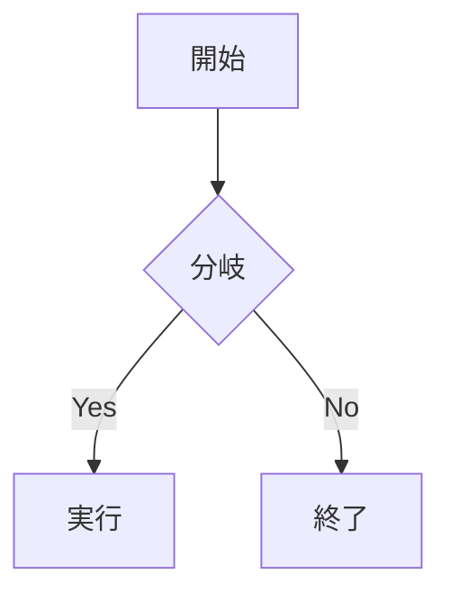

## 見出し

:::message
通常メッセージ。**太字**や`code`も使える。
:::

:::message alert
警告メッセージ。
:::

::::details 親アコーディオン
:::message
ネストしたメッセージ。
:::
::::

数式ブロック:

$$
e^{i\theta} = \cos\theta + i\sin\theta
$$

インライン $a \ne 0$ も表示できる。

```js:hello.js
const great = () => console.log("Awesome");
```

```diff js
+ const added = 1;
- const removed = 2;
  const same = 3;
```




_これはキャプションです_

@[youtube](WRVsOCh907o)

| Head | Head |
| ---- | ---- |
| Text | Text |

脚注の例[^1]。

[^1]: 脚注の内容。
